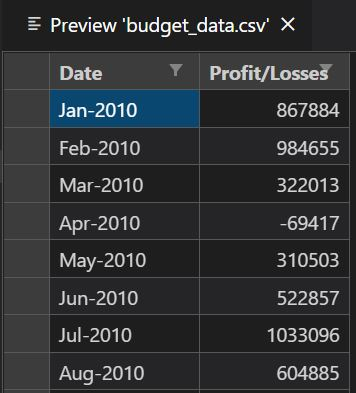
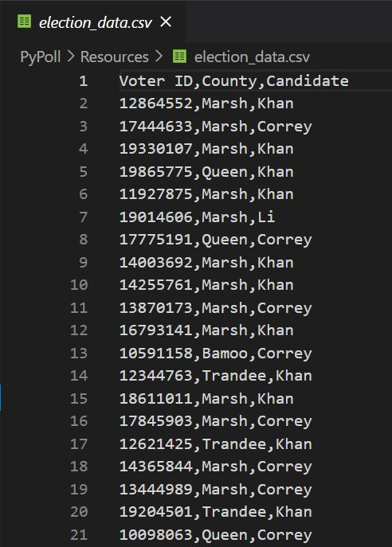

# rice-btcmp-hw3-python-challenge
Current repository contains two projects where Python default capabilities were being utilized.

## PyBank<br>Analysis of financial records of a company

### Project objective:

- In this challenge, we were tasked with creating a Python script for analyzing the financial records of a given company. We were give a set of financial data called [budget_data.csv](PyBank/Resources/budget_data.csv). 
  The dataset is composed of two columns: `Date` and `Profit/Losses`. 
- The task was to create a Python script that analyzes the records to calculate each of the following:
  - The total number of months included in the dataset
  - The net total amount of "Profit/Losses" over the entire period
  - The average of the changes in "Profit/Losses" over the entire period
  - The greatest increase in profits (date and amount) over the entire period
  - The greatest decrease in losses (date and amount) over the entire period

### Input data: 

The input file contained the following data:

* `Date` column containing date reference provided as a *string* of "Mmm-YYY" format;
* `Profit/Losses` column which contained numerical values for profits (>0) and losses (<0) <br>

### Analysis and output:

Code utilized `for` loops to cycle through all available entries in order to identify rows with highest recorded profits and lowest recorded losses, while aggregating the `Profit/Losses` volumes for *Net Total* amount and *Average of the Changes* of "Profits/Losses" calculation. Corresponding value within the `Date` column was then noted for output.

Output file [**budget_data_analysis.txt**](Resources/budget_data_analysis.txt) was created to output analysis summary and its content is reflected below:

```
Financial Analysis
----------------------------

Total Months: 86
Total: $38382578
Average  Change: $446309.05
Greatest Increase in Profits: Feb-2012 ($1170593)
Greatest Increase in Profits: Sep-2013 ($-1196225) 
```

As we can see a total of 86 months of data was available to us, with a net total volume of  ~$38.4 millions.

Average of changes in "Profit/Losses" over the entire period was ~ $446 thousands, with greatest increase in profits recorded in February 2012 ( ~ $1.17 million) followed by the greatest loss of ~ $1.2 million in September of 2013.

## PyPoll<br>Modernization of a vote counting process of a small rural town

### Project objective

- In this challenge we were tasked with helping a small, rural town modernize its vote counting process.
- We were give a set of poll data called [election_data.csv](PyPoll/Resources/election_data.csv). The dataset is composed of three columns: `Voter ID`, `County`, and `Candidate`. 
  The task was to create a Python script that analyzes the votes and calculates each of the following:
  - The total number of votes cast
  - A complete list of candidates who received votes
  - The percentage of votes each candidate won
  - The total number of votes each candidate won
  - The winner of the election based on popular vote.

### Input data: 

The input file contained the following data:

* `VoterID` a numerical column containing voter ID references;
* `Country` a string type column which contained county references for where the vote was cast;
* `Candidate` a string cloun containing names of candidates for which teh vote was cast. <br>

### Analysis and output:

Code utilized `for` loops to cycle through rows of the provided *.csv file. A list of unique names of candidates was compiled.

A new `for` loop was then used to process the database with aggregating data for a given unique candidate at a time calculating total number of votes cast for that candidate and corresponding percentage vs total number of votes cast.

The overall winner was found by comparing current candidate's total vote count to the prior one (at initial step total individual candidate vote count was set to 0). 

Results of the analysis are output to both standard gitBash output as well as within the output file [election_data_analysis.txt](PyPoll/Resources/election_data_analysis.txt).

```
Election Results
-------------------------
Total Votes: 3521001
-------------------------
Khan: 63.0% (2218231)
Correy: 20.0% (704200)
Li: 14.0% (492940)
O'Tooley: 3.0% (105630)
-------------------------
Winner: Khan
-------------------------
```

A clear winner was Khan with a total of 63% (2,218,231 votes), while the total number of people who voted was ~3.5 million